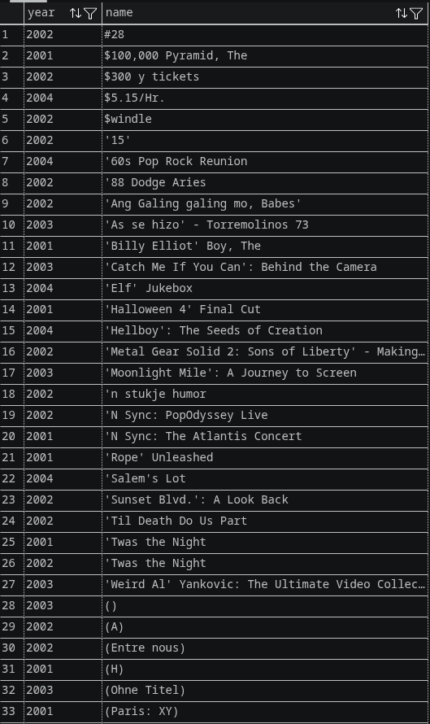
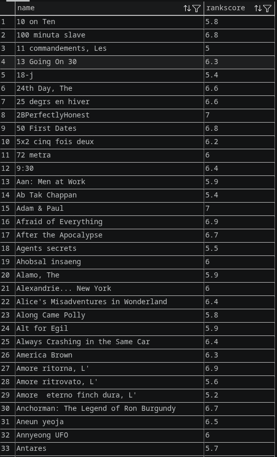
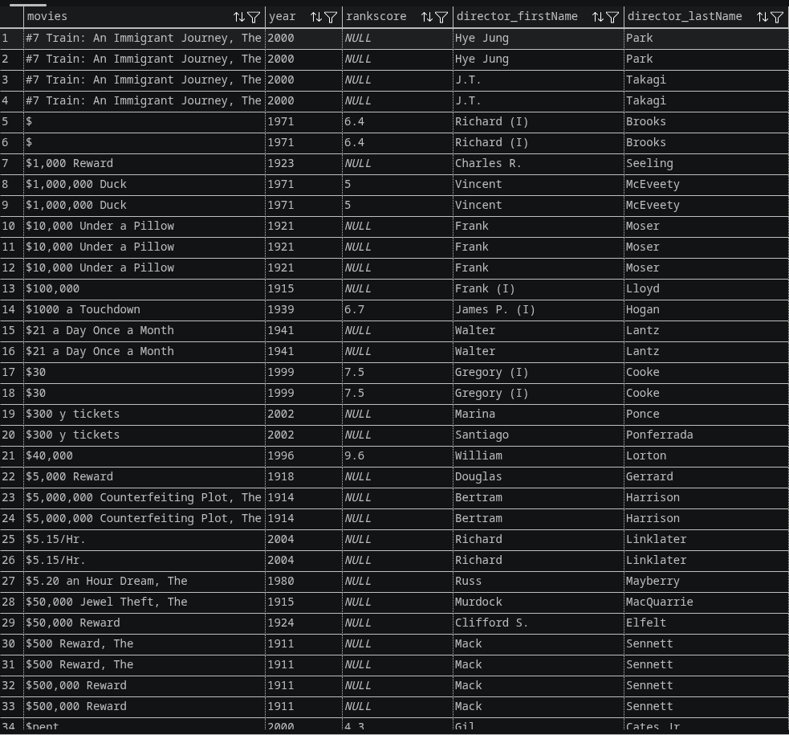
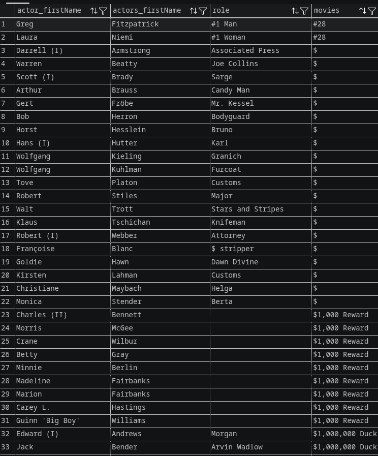

# Query IMDB 

## Query 1

### Query 1 Task 1: search movies above year 2000
```sql
SELECT "year", "name"  FROM "movies" WHERE "year" > 2000;
```


### Query 1 Task 2: search for actors with last names ending in s
```sql
SELECT "name", "rankscore" FROM "movies" WHERE "rankscore" BETWEEN 5 AND 7 AND "year" BETWEEN 2004 and 2007;
```


### Query 1 Task 3: search for movies with rankscore = 6
```sql
SELECT COUNT("name") FROM "movies" WHERE "rankscore" = 6;

```



# Query 2

### Query 2 Task 1
```sql
SELECT "m"."name" AS "movies", "m"."year", "m"."rankscore","d"."first_name" AS "director_firstName", "d"."last_name" AS "director_lastName" FROM "movies" "m" 
JOIN "movies_directors" "md" ON "m"."id" = "md"."movie_id"
JOIN "directors" "d" ON "md"."director_id" = "d"."id"
JOIN "movies_genres" "mg" ON "m"."id" = "mg"."movie_id"
LIMIT 50;
```


### Query 2 Task 2
```sql
SELECT "m"."name" AS "movies", "m"."year", "m"."rankscore","d"."first_name" AS "director_firstName", "d"."last_name" AS "director_lastName" FROM "movies" "m" 
JOIN "movies_directors" "md" ON "m"."id" = "md"."movie_id"
JOIN "directors" "d" ON "md"."director_id" = "d"."id"
JOIN "movies_genres" "mg" ON "m"."id" = "mg"."movie_id"
LIMIT 50;
```


### Query 3 Task 1

```sql

SELECT  CONCAT("directors"."first_name", "directors"."last_name") AS "directors_name", COUNT(DISTINCT "movies_genres"."genre") AS "total" FROM "directors"
JOIN "movies_directors" ON "directors"."id" = "movies_directors"."director_id"
JOIN "movies" ON "movies_directors"."movie_id" = "movies"."id"
JOIN "movies_genres" ON "movies_genres"."movie_id" = "movies"."id"
GROUP BY "directors_name" 
ORDER BY "total" 
DESC LIMIT (50);
```


### Query 3 Task 2

```sql

SELECT "actors"."id", "actors"."first_name", "actors"."last_name", COUNT("roles"."role") AS "jumlah_roles"
FROM "actors"
JOIN "roles" ON "actors"."id" = "roles"."actor_id"
GROUP BY "actors"."id", "actors"."first_name", "actors"."last_name"
HAVING COUNT("roles"."role") > 5
ORDER BY "jumlah_roles" DESC LIMIT (100);
```


### Query 3 Task 3

```sql

SELECT CONCAT("directors"."first_name","directors"."last_name") AS "directors_name", COUNT("movies"."id") AS "jumlah_film" FROM "directors"
JOIN "movies_directors" ON "directors"."id" = "movies_directors"."director_id" 
JOIN "movies" ON "movies_directors"."movie_id" = "movies"."id"
GROUP BY "directors_name"
ORDER BY "jumlah_film" DESC LIMIT (1);

```


### Query 3 Task 4

```sql

SELECT "year", COUNT("year") AS "total" FROM "movies" 
GROUP BY "year" 
ORDER BY "total" DESC LIMIT (1) ;
```


### Query 3 Task 5
```sql

SELECT "movies"."name", STRING_AGG("movies_genres"."genre", ', ') AS "genre" FROM "movies_genres"
JOIN "movies" ON "movies_genres"."movie_id" = "movies"."id"
GROUP BY "movies"."name" LIMIT(50); 
```


